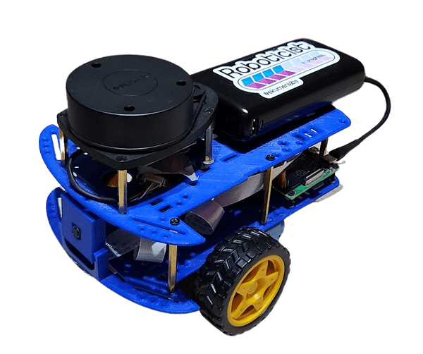
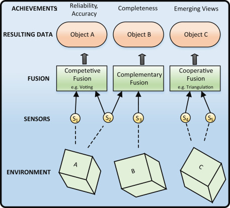
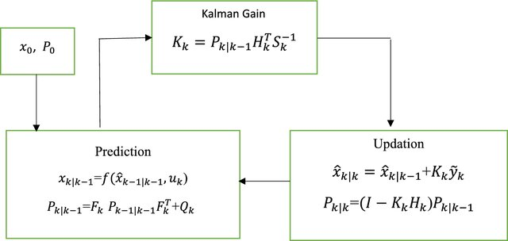

# OpticalOdometer-SensingSystem
A low-cost slip-aware odometry upgrade for indoor robots, adding ground-referenced motion sensing without replacing existing systems.

Low-cost optical surface odometry upgrade for indoor differential-drive robots.

SlipGuard-Odo adds a downward-facing ADNS-3050 optical navigation sensor to an existing wheel-encoder and IMU odometry stack. The goal is not to replace wheel odometry, but to add a ground-referenced motion signal that can reduce drift when wheels slip on polished or low-friction indoor floors.



Example target platform: a compact ROS-compatible educational robot where adding a small downward optical module is cheaper and simpler than replacing the whole localization stack.

## Quick Value

- Target upgrade price: below GBP 30 per robot.
- Prototype build cost: GBP 15-25.
- Volume BOM target: GBP 6-8.5.
- Interface: SPI sensor module with ROS 2 odometry and diagnostics topics.
- Main use cases: teaching robots, student platforms, low-cost AMRs, and ROS 2 slip-testing experiments.

## Where It Fits on the Robot

Mount the optical module under the chassis, facing the floor. The wheel encoders and IMU stay in place; SlipGuard-Odo simply adds a second motion channel that is tied to the surface rather than to wheel rotation.

Recommended placement:

- Under the robot body, away from wheel shadows and direct external light.
- Rigidly mounted so the sensor-to-floor height stays near 5-10 mm.
- Close enough to the robot centreline to reduce extra calibration complexity.
- Connected to the main controller through SPI or through a small local MCU bridge.

## Upgrade Package

| Block            | Component / Output                           | Purpose                                                      |
| ---------------- | -------------------------------------------- | ------------------------------------------------------------ |
| Optical sensor   | ADNS-3050 optical navigation sensor          | Reads relative floor motion as `Delta X` and `Delta Y` counts. |
| Optics           | ADNS-5110-001 lens and ADNS-5200 clip/holder | Maintains the short focal distance and stable sensor-to-floor geometry. |
| Illumination     | HLMP-EG3E red LED or equivalent              | Provides controlled surface lighting for optical tracking.   |
| Local controller | STM32G030F6P6 or similar MCU                 | Reads SPI motion counts and prepares data for the robot controller. |
| PCB              | Small 2-layer PCB                            | Carries sensor, LED, MCU, power, and signal routing.         |
| Mechanical mount | 3D-printed or machined bracket               | Holds the module 5-10 mm above the floor.                    |
| ROS 2 output     | `/optical/odom` and diagnostics              | Supplies calibrated optical velocity and tracking quality to the EKF. |
| Fusion output    | EKF fused odometry                           | Combines wheel encoders, IMU yaw, and optical surface odometry. |

## Key Specifications

| Item                     | Target / Reference Value                                     |
| ------------------------ | ------------------------------------------------------------ |
| Sensor principle         | Optical surface navigation                                   |
| Motion output            | Relative displacement counts, `Delta X` and `Delta Y`        |
| ADNS-3050 max resolution | 2000 CPI                                                     |
| ADNS-3050 tracking speed | 60 ips, about 1.5 m/s                                        |
| ADNS-3050 frame rate     | Up to 6400 fps, auto-adjusting                               |
| Electrical interface     | 4-wire SPI                                                   |
| Sensor supply voltage    | 2.8-3.0 V                                                    |
| Module update target     | >= 100 Hz                                                    |
| Mounting height target   | 5-10 mm above floor                                          |
| Operating focus          | Indoor flat surfaces, especially where wheel slip causes odometry drift |

## Estimated BOM

| Item                  | Example Source / Note            | Indicative Cost                             |
| --------------------- | -------------------------------- | ------------------------------------------- |
| ADNS-3050 sensor      | Optical navigation IC            | Included in module estimate                 |
| ADNS-5110-001 lens    | Alibaba listing                  | GBP 0.67-1.10 by quantity                   |
| HLMP-EG3E LED         | Mouser listing                   | GBP 0.254-0.63 by quantity                  |
| ADNS-5200 clip/holder | Optical sensor fixture           | About GBP 0.50 estimate                     |
| STM32G030F6P6 MCU     | Low-cost STM32 controller        | GBP 0.553-1.14 by quantity                  |
| 2-layer PCB           | JLCPCB prototype/volume PCB      | About GBP 0.40 each in small batch estimate |
| Mechanical bracket    | 3D print or simple machined part | Depends on material and quantity            |
| Full prototype module | Sensor, optics, MCU, PCB, mount  | GBP 15-25                                   |
| Volume module target  | 1k-scale production assumption   | GBP 6-8.5                                   |

## Cost Context

| Alternative        | Representative Part              | Approximate Cost                      | Notes                                                        |
| ------------------ | -------------------------------- | ------------------------------------- | ------------------------------------------------------------ |
| LiDAR              | SICK TiM571 / TiM510 class       | About GBP 1129+                       | Strong navigation sensor, but too expensive for many teaching or low-cost AMR platforms. |
| UWB localization   | Qorvo DWM1000                    | About GBP 20                          | Useful for infrastructure-based indoor localization, but requires anchors and environment setup. |
| Industrial encoder | Omron E6B2 class                 | About GBP 200                         | Precise rotary sensing, but does not directly solve floor slip. |
| SlipGuard-Odo      | ADNS-3050 optical surface module | GBP 6-8.5 volume, GBP 15-25 prototype | Low-cost add-on channel for slip-aware odometry.             |

## System Flow



```text
Wheel encoders        IMU yaw-rate        Optical surface module
      |                    |                       |
      +--------------------+-----------------------+
                           |
                    ROS 2 EKF fusion
                           |
                   /odometry/filtered
```

The optical module publishes calibrated floor-relative motion. The EKF can down-weight or reject optical readings when the sensor reports low quality, poor texture, excessive height variation, or reflective-floor failure modes.



## Suggested ROS 2 Topics

| Topic                  | Content                                                      |
| ---------------------- | ------------------------------------------------------------ |
| `/wheel/odom`          | Baseline wheel odometry from encoders.                       |
| `/imu/data`            | IMU angular velocity, especially yaw-rate.                   |
| `/optical/odom`        | Optical surface velocity or incremental odometry after scale calibration. |
| `/optical/diagnostics` | Sensor quality, update status, and rejection flags.          |
| `/odometry/filtered`   | Final fused EKF odometry output.                             |

## Validation Plan

Test encoder-only odometry against encoder + optical fusion.

Recommended test surfaces:

- High-friction floor.
- Medium-slip floor.
- Low-friction or polished floor.

Recommended motion profiles:

- Straight-line runs.
- Circles.
- Figure-8 paths.
- Stop-and-go motion.

Recommended metrics:

- Final position drift.
- Trajectory RMSE.
- Failure ratio under slip.
- Optical tracking quality and rejected-measurement count.

## Known Limits

- A single optical sensor mainly measures planar translation; heading still depends on wheel odometry and IMU yaw.
- Tracking can degrade on reflective, transparent, very dark, dusty, or low-texture floors.
- Mounting height matters; the module should keep a stable 5-10 mm sensor-to-floor distance.
- The optical channel should be fused with quality checks, not blindly trusted.

## Resource Links

Component and pricing references:

- ADNS-3050 optical navigation sensor: <https://www.digipart.com/part/ADNS-3050>
- ADNS-5110-001 lens listing: <https://chinese.alibaba.com/product-detail/New-Original-Mouse-Lens-ADNS-5110-1601344837483.html>
- HLMP-EG3E LED listing: <https://www.mouser.co.uk/ProductDetail/Broadcom-Avago/HLMP-EG3E-QT000?qs=KGuh8pVqpP%252B6ciRgYGD%252BEw%3D%3D>
- JLCPCB PCB service: <https://jlcpcb.com/>
- 3DPRINTUK pricing: <https://www.3dprint-uk.co.uk/pricing/>

Comparison references:

- SICK TiM510/TiM571 class LiDAR listing: <https://uk.farnell.com/sick/tim510-9950000s01/2d-lidar-sensor-4m-pnp-9-to-28vdc/dp/4406302>
- Qorvo DWM1000 UWB module listing: <https://uk.farnell.com/qorvo/dwm1000/transceiver-module-6-8mbps-6-5ghz/dp/4683738>
- Omron E6B2 industrial encoder listing: <https://uk.farnell.com/omron-industrial-automation/e6b2cwz6c500pr2moms/incremental-rotary-encoder-6000rpm/dp/2507150>

Technical background:

- ROS `robot_localization` documentation: <https://docs.ros.org/en/noetic/api/robot_localization/html/index.html>
- REP-105 coordinate frames: <https://www.ros.org/reps/rep-0105.html>
- Moore and Stouch, generalized EKF for ROS: <https://docs.ros.org/en/noetic/api/robot_localization/html/_downloads/1c51b4cda4ceb8a27476715a980a5ec2/robot_localization_ias13_revised.pdf>
- Borenstein and Feng, systematic odometry error correction: <https://ieeexplore.ieee.org/document/544770/>
- Tresanchez et al., optical mouse sensor as an incremental rotary encoder: <https://linkinghub.elsevier.com/retrieve/pii/S0924424709003483>
- Sekimori and Miyazaki, mobile robot dead-reckoning with optical mouse sensors: DOI `10.1007/978-1-4020-5626-0_18`

## Image Credits

- `andino_robot.png`: <https://discourse.openrobotics.org/t/andino-an-open-source-low-cost-educational-robot/32632>
- `sensor-fusion-example.jpg`: <https://www.sciencedirect.com/topics/engineering/sensor-fusion>
- `Block-diagram-for-Extended-Kalman-filter_W640.jpg`: <https://www.researchgate.net/publication/375879772_Hybrid_Acoustic_System_for_Underwater_Target_Detection_and_Tracking/figures?lo=1>
